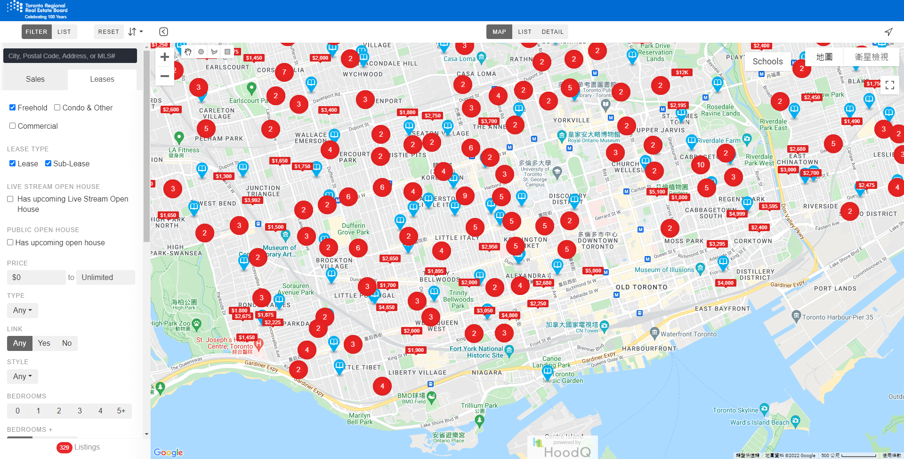
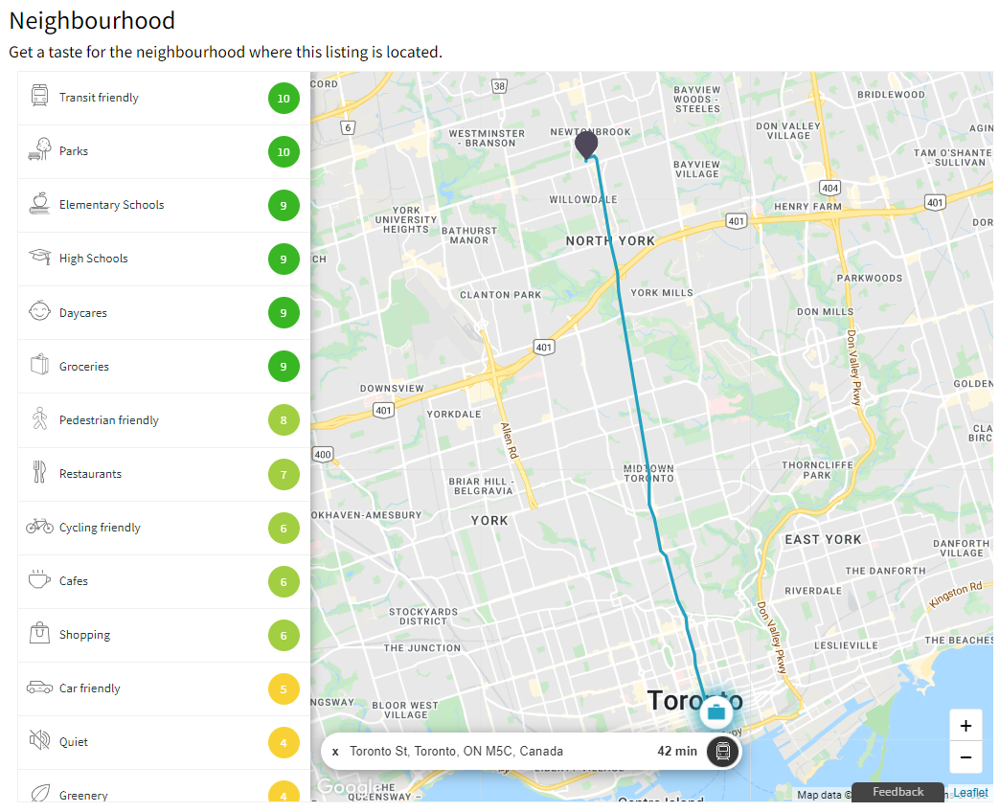
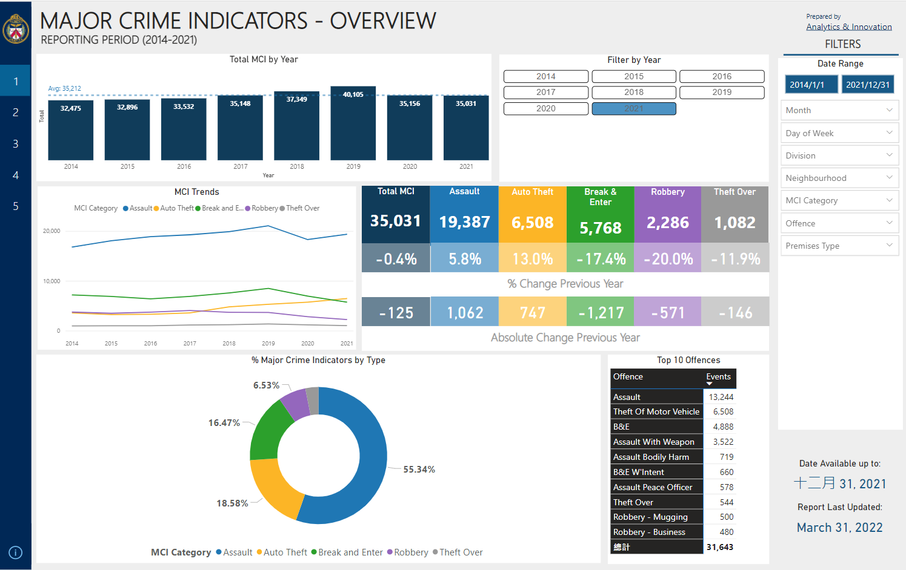

# Framing the business problem
> **Objective: Where should I rent an apartment in the City of Toronto in next 3 months?**
- Tangible output
  - An interactive map where I can quickly locate the ideal areas to search for rental listings
- Assumptions
  - **Ideal location = safe + cheap + nearby** (more details on the 3 factors below)
  - As an international student without a driving license, I would have to rely on TTC to move around the city and that implies I do not live outside the City of Toronto
  - All apartments within a neighbourhood are considered as homogeneous as we view each neighbourhood as the smallest unit
- ML problem
  - supervised regression task to project rent, crime rates and traffic collisions in the future
  - offline learning as there won't be live data feed 
  - performance measurement: RMSE of regression tasks

# 3 factors for tenants to consider include:
1. **Safety**
    - Existing solution:
        - Toronto Police Services [Power BI dashboard](https://app.powerbi.com/view?r=eyJrIjoiNTAwOTNkMTYtOWQwNS00Y2M3LWJkODAtNDU1NjNkZTg1YWVkIiwidCI6Ijg1MjljMjI1LWFjNDMtNDc0Yy04ZmI0LTBmNDA5NWFlOGQ1ZCIsImMiOjN9)
    - Data souces
        - Toroto Police Services - [Public Safety Data Portal](https://data.torontopolice.on.ca/)
        - City of Toronto - [Open Data Portal](https://open.toronto.ca/)
        - All of the above materials are licensed under the [Open Government License - Toronto](https://open.toronto.ca/open-data-license/)
2. **Accessibility**
    - Existing Solution:
        - Realtor.CA neighbourhood [overview](https://www.realtor.ca/)
    - We can measure the commute time and / or distance to a destination with the help of 
        - Google map or other location services
    - Limitation: 
        - Requesting commute time between locations requires access to Google's paid API services
        - Commute time can vary depending on the time of departure and mode of transit,
            - e.g. it may only take 45min to take the train departing at 8:30am but if you miss the train, you will spend 1hr30min on bus
    - Solution: measure **distance** between locations instead (calculated using longitude and latitude)
3. **Affordability**
    - Existing Solution:
        - Toronto Regional Real Estate Board (TRREB) [search engine](https://onlistings.trreb.ca/searchlistings#search/d17c8105b8d19ca9a20f2d67/filters)
    - Limitation: scraping information from the **search engine** real estate websites is often *prohibited by the copywright clause* under the terms of use
    > E.g. Realtor.ca's [terms of use](https://www.realtor.ca/terms-of-use) explicitly states that **scraping** and any other activity intended to collect, store, reorganize or manipulate data on the pages produced by, or displayed on the CREA websites are prohibited
    - Solution: scraping information from **public quarterly reports** published by Toronto Regional Real Estate Board (TRREB)
        - Loss in granularity: data is only available per MLS region but not per transaction or per listing

# Limitations of existing solutions
**Existing solutions put emphasis on 1 angle only**
- e.g. rental websites focus on price -> you can then click into the listing to view other information such as transportation and neighbourhood safety
- e.g. police website focuses on safety -> you can then look at listings in that neighbourhood
- **what if I want to look for the ideal locations based on the 3 factors simultaneously?**

Toronto Regional Real Estate Board (TRREB) [search engine](https://onlistings.trreb.ca/searchlistings#search/d17c8105b8d19ca9a20f2d67/filters)
- 
Realtor.CA neighbourhood [overview](https://www.realtor.ca/)
- 
Toronto Police Services [Power BI dashboard](https://app.powerbi.com/view?r=eyJrIjoiNTAwOTNkMTYtOWQwNS00Y2M3LWJkODAtNDU1NjNkZTg1YWVkIiwidCI6Ijg1MjljMjI1LWFjNDMtNDc0Yy04ZmI0LTBmNDA5NWFlOGQ1ZCIsImMiOjN9)
- 